# redis nosql数据库

## 1.redis介绍

### 1.1引言

> 1.由于用户数量增大，请求数量随之增大，导致数据库压力过大
>
> 2.多台服务机之间数据不同步
>
> 3.多台服务器之间的锁，已经不存在互斥性了

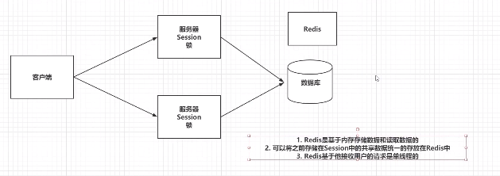

### 1.2 NoSQL

> redis 就是一款NoSql： 键值对： key：value
>
> NoSql->非关系型数据库->Not Only SQL
>
> 1.key-value: Redis memocache
>
> 2.文档型：ElasticSearch，Solr，Mongodb
>
> 3.面向列：HBase，Cassandra
>
> 4.图形化：Neo4j
>
> 除了关系型数据都是非关系型数据库
>
> NoSQL只是一种概念，反之非关系型数据看，和关系型数据库做一个区分

### 1.3 Redis介绍

> 意大利人开发，因为MySql性能不足以应付使用场景
>
> redis的含义：Remote Dictionary Server 远程字典服务，Redis又C语言开发，是一款key-value的NoSql，redis基于内存作为存储介质，也提供多种持久化机制。性能可以达到110000/s读性能，81000/s写数据，Redis提供了主从、哨兵以及期权的搭建方式，可以方便的进行节点扩展。

## 2.redis 安装

docker方式安装，略

## 3.redis常用命令

### 3.1 redis数据结构

> 常用的物种：
>
> key-string：一个key对应一个字符串
>
> key-hash：一个key对应一个Map
>
> key-list：一个key对应一个列表（可重复有索引）
>
> key-set：一个key对应一个集合（不可重复无序）
>
> key-zset：一个key对应一个有序集合（不可重复有序）
>
> 另外三种：
>
> Hyperloglog：计算近似值
>
> GEO:地理位置
>
> BIT:一般存储的也是一个字符串，存的是一个byte[]

五种常用的数据结构

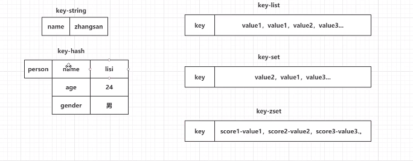

> key-string：最常用的，一般存储一个值
>
> key-hash：存储一个对象
>
> key-list：使用list结构实现栈或者队列结构
>
> key-set：交集、差集、并集的操作
>
> key-zset：排行榜，积分存储等操作。

### 3.2 string常用命令

```sh
#1 添加值
set key value
#2 取值
get key

#3.批量操作
mset key value [key value]
mget key [key1 key2]
```

-----------

```sh
# 4 自增命令（自增1）
incr key

#5 自减命令（自减1）
decr key

#6 自增或自减指定数量
incrby key increment
decrby key increment
```

-------------

```sh
#7 设置值的同时，指定生存时间(每次向redis中添加数据是，尽量设置生存时间)
setex key second value

#8 设置值，如果当前key不存在的话（如果这个key存在，什么事都不做，否则就设置值）
#一般用分布式锁竞争（基于单线程模型）
setnx key value

#9 在key对应value后，追加内容
append key value

#10 查看value字符串的长度
strlen key
```

> 参考文档http://redisdoc.com/

### 3.3 hash常用命令

```sh
#1 存储数据
hset key field value

#2 取数据
hget key field

#3 批量操作
hmset key field value [field value]
hmget key field [field1 field2]
```

--------------

```sh
#4 自增（指定自增值）
hincrby key field increment
```

-------

```sh
#5 设置值（如果key-field不存在，那就正常添加，如果存在，什么都不做）
hsetnx key field value

#6 检查field是否存在
hexists key field

#7 删除key对应的某一个或多个field
hdel key field [field1,field2]

```

----

```sh
#8 获取当前hash结构中的全部feild和value
hgetall key

#9获取当前hash结构中的全部feild
hkeys key

#10 获取当前hash结构中的全部value
hvals key

#11 获取hash中field数量
hlen key
```

### 3.4 list常用命令

```sh
#1 从左侧存数据
lpush key value [value ...]

#2 从右侧插入
rpush key value [value....]

#3 存储数据（如果key不存在，什么事都不做，如果key存在但不是list结构，什么都不做）
lpushx key value 
rpushx key value 

#4 指定索引位置存储数据,会覆盖原索引位置上的数据
lset key index value
```

-------------

```sh
#4 弹栈方式获取数据（从左或从右）
lpop key
rpop key

#5 获取指定索引范围数据（start从0开始，stop输入-1，代表最后一个，-2 代表倒数第二个）
lrange key start stop

#6 获取指定索引的数据
lindex key index

#7获取列表长度
llen key
```

-----------------------

```sh
#8 删除列表数据(删除当前列表中count个value，count>0，从左侧向右侧删除，count<0从左侧删除，count==0删除全部value)
lrem key count value

#9 保留列表中的数据（保留指定范围的数据，超过范围都会移除）
ltrim key start stop

#10 将一个列表中最后的一个数据插入到另一个列表的头部位置（具有原子性）
rpoplpush list1 list2
```

### 3.5 set常用命令

```sh
#1 存储数据
sadd key member [member...]

#2 获取全部数据
smembers key

#3 随机获取一个或多个数据（弹栈方式）
spop key [count]

```

--------------

```sh
#4 交集命令(区多个set集合的交集)
sinter set1 set2 .....

#5 并集（取多个集合并集）
sunion set1 set2 ....

#6 差集（获取多个集合中不一样的数据,只取第一个集合中的数据）
sdiff set1 set2 ....
```

----

```sh
#7 删除数据（指定具体的value去删除）
srem key member [member....]

#8 查看当前的set集合中是否包含这个值
sismember key member
```

### 3.6 zset常用命令

```sh
#1 添加数据(score必须是数值)
zadd key score member [score member...]

#2 修改member的分数(member如果存在，就正常价分数，如果不存在，这个命令就相当于与zadd)
zincrby key increment member
```

-------

```sh
#3 查看指定的member的分数
zscore key member

#4 获取数据数量
zcard key

#5 查询score的范围member数量
zcount key min max

#6 删除zset的成员
zrem key memeber [member....]
```

---------

```sh
#7 根据分数从小到大排序，获取指定分数排名范围的数据（withscores如果添加这个参数，那么会返回member对应的分数）
zrange key start stop [withscores]

#8 根据分数从到大排序，获取指定范围的数据（withscores如果添加这个参数，那么会返回member对应的分数）

zrevrange key start stop [withscores]

#9 根据分数的范围去获取数据（withscores如果添加这个参数，那么会返回member对应的分数,如果添加limit就和mysql一样）
zrangebyscore key min max [withscores][limit offset count]

#10 根据分数的范围去获取数据（withscores如果添加这个参数，那么会返回member对应的分数,如果添加limit就和mysql一样）
zrevrangebyscore key max min  [withscores][limit offset count]

# 以上两个命令如果在max或min前加“(”括号，代表不带等于，如果要查最大分数或最小分数，用+inf,-inf
```

### 3.7 key的常用命令

```sh
#1 查看redis全部的key（pattern *，xxxx*，*xxxx）
keys pattern

#2 查看key是否存在
exists key

#3 删除key
del key [key ....]
```

-----

```sh
#4 设置key的生存时间，单位为秒或毫秒
expire key second
pexpire key milliseconds

#5 设置key的生存时间，设置活到什么时间点
expireat key timestamp(秒)
pexpireat key timestamp（毫秒）

#6 查看key的生存时间（-2 当前key不存在，-1 当前key没生存时间）
ttl key
pttl key

#7 移除key生存时间（1，移除成功，09 key不存在生存时间或者key不存在）
persist key
```

---------

redis默认有16个库，我们可以操作库

```sh
#8 选择操作的库
select 0~15

#9移动key到另外一个库
move key db
```

### 3.8 库的常用命令

```sh
#1 清空当前的所在数据库
flushdb

#2 清空所有库
flushall

#3 查看当前数据库有多少个key
dbsize

#4 查看最后一次将数据保存到磁盘上的时间
lastsave

#5 实时监控服务接收到的目录
monitor
```

## 4.java连接redis

> Jedis连接reids ，Lettuce连接redis

### 4.1 jedis连接redis

> 1. 创建maven项目
> 2. 导入需要的依赖
> 3. 测试

导入依赖

```xml
<dependency>
    <groupId>redis.clients</groupId>
    <artifactId>jedis</artifactId>
    <version>2.9.0</version>
</dependency>
<dependency>
    <groupId>org.projectlombok</groupId>
    <artifactId>lombok</artifactId>
    <version>1.18.16</version>
    <scope>provided</scope>
</dependency>
```

测试

```java
public class Demo1{
   @Test 
   public void test(){
       //1 连接redis
       Jedis jedis = new Jedis("192.168.199.109",6379)
       //2 操作redis
       jedis.set("name","lisi")
       //3 释放资源
       jedis.close();
   }
    
   @Test
   public void get(){
       //1 连接redis
       Jedis jedis = new Jedis("192.168.199.109",6379)
       //2 操作redis
       String value = jedis.get("name");
       System.out.println(value);
       //3 释放资源
       jedis.close();
   }
}
```

#### 4.2 Jedis存储对象

创建实体类

```java
@Data
@AllArgsConstructor
@NoArgsConstructor
public class User implement Serializable{
    private Integer id;
    private String name;
    private Date birthday;
}
```

添加依赖

```xml
<dependency>
    <groupId>org.springframework</groupId>
    <artifactId>spring-context</artifactId>
    <version>5.2.9.RELEASE</version>
</dependency>
```

创建测试

```java
public class Demo2{
    @Test
    public void setByteArray(){
        //1 连接redis服务
        Jedis jedis = new Jedis("192.168.199.109",6379)  
        //2.准备key（string）-value（User）
        String key = "user";
        User user =new User(1,"zhangsan",new Date());
        //3 存储
        byte[] bytekey = SerializationUtils.serialize(key);
        byte[] byteValue = SerializationUtils.serialize(value);
        jedis.set(byteKey,byteValue);
        //4 释放资源
        jedis.close();   
    }
    
    @Test
    public void getByteArray(){
        //1 连接redis服务
        Jedis jedis = new Jedis("192.168.199.109",6379)  
        //2.准备key（string）
        String key = "user";
      
        //3 获取value
        byte[] bytekey = SerializationUtils.serialize(key);
       
        byte[] byteValue = jedis.get(byteKey);
        
        //4 反序列化value
        User user =  (User)SerializationUtils.deserialize(byteValue);
        
        //5 释放资源
        jedis.close();   
    }
}
```

### 4.3 jedis存储对象string形式

导入fastjson依赖

```xml
<dependency>
	<groupId>com.alibaba</groupId>
    <artifactId>fastjson</artifactId>
    <version>1.2.47</version>
</dependency>
```

测试类

```java
public class Demo3{
    @Test
    public void setByteArray(){
        //1 连接redis服务
        Jedis jedis = new Jedis("192.168.199.109",6379)  
        //2.准备key（string）-value（User）
        String key = "user";
        User user =new User(1,"zhangsan",new Date());
        //3 存储
       	String stringValue = JSON.toJSONString(value);
        jedis.set(key,stringValue);
        //4 释放资源
        jedis.close();   
    }
    
    @Test
    public void getByteArray(){
        //1 连接redis服务
        Jedis jedis = new Jedis("192.168.199.109",6379)  
        //2.准备key（string）
        String key = "user";
      
        //3 获取value
        String strValue = jedis.get(key);
        
        //4 反序列化value
        User user =  JSON.parseObject(strValue,User.class);
        
        //5 释放资源
        jedis.close();   
    }
}
```

### 4.4 jedis连接池

上面的操作每次都在频繁创建jedis连接对象，消耗资源

```java
public class Demo4{
    //简单方式
    @Test
    public void pool(){
        //1 创建连接池
       	JedisPool pool = new JedisPool("192.168.134.100",6379)
        
        //2 通过连接池获取jedis对象
        Jedis jedis = pool.getResource();
        //3 操作
        String value = jedis.get("stringUser");
       
        //4 释放资源
        jedis.close();
    }
  	//指定参数方式
    @Test
    public void pool2(){
        //1 创建连接池配置信息
        GenericObjectPoolConfig config = new GenericObjectPoolConfig();
        config.setMaxTotal(100);//指定最大活跃数
        config.setMaxIdle(10);//最大空闲数
        config.setMinIdle(5);//最小空闲数
        config.setMaxWaitMillis(3000);//当连接池空了之后，多久没获取到jedis对象就超时
        //2 创建连接池
       	JedisPool pool = new JedisPool(config,"192.168.134.100",6379)
        
        //3 通过连接池获取jedis对象
        Jedis jedis = pool.getResource();
        //4 操作
        String value = jedis.get("stringUser");
       
        //5 释放资源
        jedis.close();
    }
}
```

### 4.5 redis管道操作

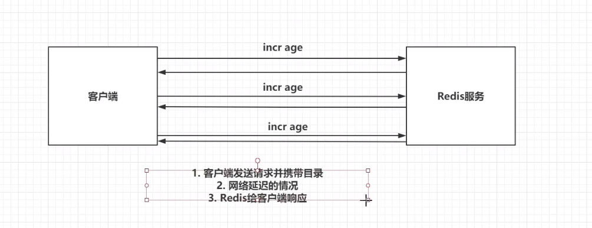

上图消耗时间和网络io

>  管道：

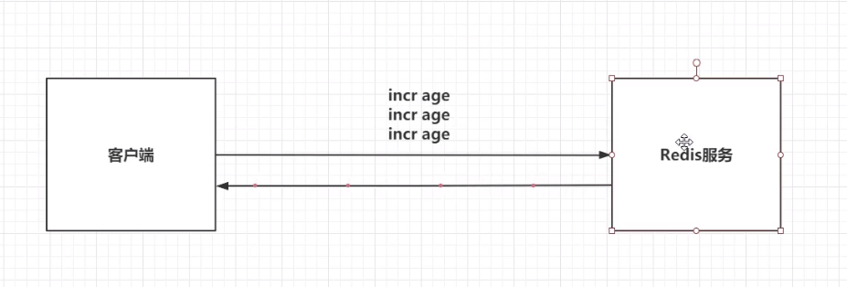

测试类

```java
public void pipeline(){
    long l = System.currentTimeMillis()
    System.out.println(l);
    //1 创建连接池
    JedisPool pool = new JedisPool("192.168.134.100",6379);
    //2 获取连接对象
    Jedis jedis = pool.getResource();
    //3 执行incr-100000
    for (int i = 0;i<1000000;i++){
        jedis.incr("pp");
    }
    //4 释放资源
    jedis.close();
    //=============
    //2 获取连接对象
    Jedis jedis = pool.getResource();
    //3 创建管道
    Pipeline pipeLine = jedis.pipelined();
    //4 执行incr-100000
    for (int i = 0;i<1000000;i++){
        pipeLine.incr("qq");
    }
    pipeLine.syncAndReturnAll();
    //5 释放资源
    jedis.close();
    System.out.println(System.currentTimeMillis()-l);
}
```

## 5 redis其他配置及集群

### 5.1创建docker-compose.yaml

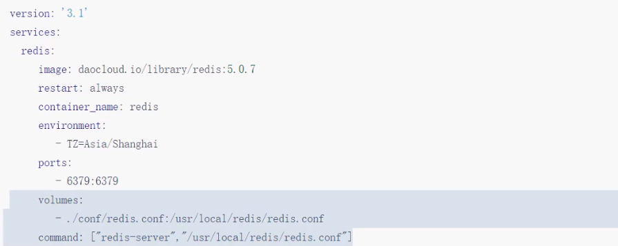

### 5.2redis 的auth

修改redis.conf

```conf
#redis的auth密码
requirepass 1234

```

redis客户端操作

```sh
auth 1234 #设置密码
```

java客户端

```java
jedis.auth("1234");
```

jedis连接池方式

```java
JedisPool pool = new JedisPool("192.168.134.100",6379,3000,"1234");
```

#### 第二种方式配置auth

通过客户端命令

```sh
config set requirepass 1234
```

> 这种方式redis重启后密码失效

### 5.2 redis的事务

> redis的事务，一次事务操作，该成功的成功，该失败的失败

开启事务，执行一系列的命令，但是不会立马执行，会被放入一个队列中，如果你执行事务，那么这个队列中的命令全部执行，如果取消了书屋，一个队列中的命令全部作废

#### 演示开启事务

在客户端输入

```sh
multi
set age 24
set birthday 2000-01-01
exec

discard #取消事务
```

演示错误命令不会影响事务

```sh
multi
set age 24
set birthday 2000-01-01
set name zhangsan
incr name
(error).......
exec

```

可以发现incr name命令不会影响到事务其他命令的执行

#### watch监听机制

watch机制可以监听key的变化，当watch配置事务运行时，当有其他客户端修改了被监听的key，就会导致watch自动取消，事务也取消

演示：

打开一个客户端

```sh
watch name age
multi
set name wangwu
set age 44
```

打开新客户端

```sh
set name zhaoliu
```

回到老客户端

```
exec
nil
```

##### 总结

1.开启事务：multi

2.执行具体命令，被放入一个队列中

3.执行事务：exec

4.取消事务：discard

Redis的事务想要发挥功能，需要配置watch监听机制

在开启redis事务之前，先通过watch去监听一个或多个key，在开启事务之后，如果有其他客户端修改了监听的key，事务会自动取消，实际上就是cas。

如果执行了事务或者取消了事务，watch监听自动消除，一般不需要手动取消监听unwatch

### 5.3 redis持久化机制

查看redis.conf文件找到如下内容

```
save 900 1
save 300 10
save 60 10000
rdbcompression yes
dbfilename dump.rdb
```

这是redis第一种持久化方式RDB的配置

其中如下配置配置了RDB执行的时机

```
# 900秒之内有一个key改变了就持久化
save 900 1
# 300秒内有一个key改了就持久化
save 300 10
# 60秒内有10000个key改变了就持久化
save 60 10000
```

RDB不能保证持久化，可能会丢失数据，但是效率比较高

速度快

```
#持久化文件的位置，放在/data目录下
dbfilename dump.rdb
```

演示rdb持久化

修改docker中的配置文件，并且挂载data目录

```yaml
 -./data:/data
```

设置一个值，然后shutdown

```sh
set name zhangsan
shutdown save
```

检查data目录下的文件

重启redis，检查数据库是否有name：张三

#### RDB持久化

1.rdb持久化文件，速度比较快，而且存储的是一个二进制文件，传输很方便。

2.rdb持久化的时机可设置

3.rdb无法保证数据的绝对安全。

#### AOF持久化机制

查看redis.conf配置文件

```
appendonly no #默认关闭
appendfilename "appendonly.aof" #持久化位置
#aof持久化时机，三选一
# appendfsync always #同步持久化，每次发生数据变化会立刻写入到磁盘中，性能比较低
appendfsync everysec #，每秒异步记录一次
# appendfsync no #不同步，不是真的不同步，而是会根据你的操作系统的不同，环境的不同，在一定时间内执行一次持久化
```

##### 演示aof

修改配置文件

```
appendonly yes
appendfilename "redis.aof"
appendfsync everysec
```

> rdb和aof可同时开启

启动容器，操作客户端

```sh
redis-cli
set name lisi
shutdown nosave #rdb不会执行
```

检查`redis.aof`

##### AOF机制

AOF持久化默认是关闭的，Redis官方推荐同时开启RDB和AOF持久化，更安全，避免丢失数据，

1.AOF持久化的速度，相对RDB慢，存储的是一个文本文件，到了后期文件比较大，传输困难

2.AOF相对RDB更安全，推荐同时开启AOF和RDB

> 如果同时开启了AOF和RDB，那么redis宕机重启后，需要加载一个持久化文件，优先选择aof文件
>
> 如果先开启了RDB，再开启AOF，如果RDB执行了持久化，那么RDB文件中的内容会被AOF覆盖掉。

### 5.4 redis的主从架构

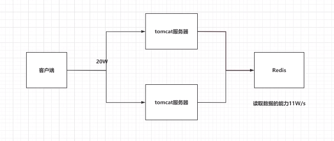

主从架构

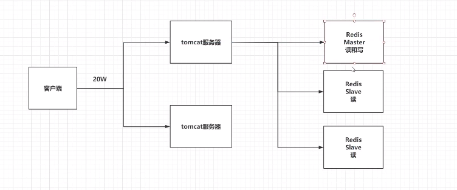

> 单机版redis存在读写瓶颈的问题

#### 演示主从架构

> https://www.jianshu.com/p/f0e042b95249

1.修改docker-compose.yaml

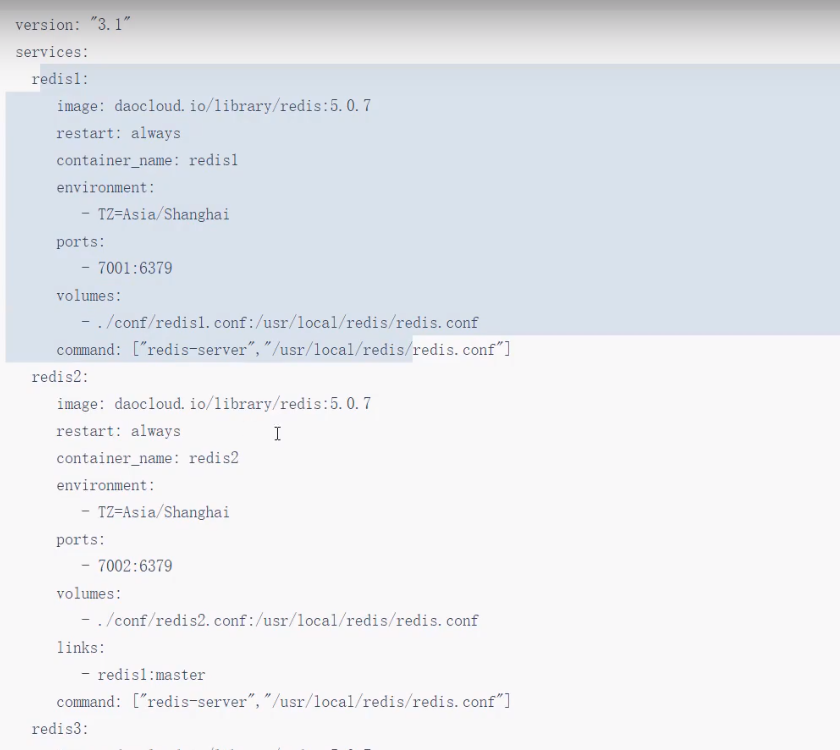

```yaml
version: "3"
services:
   redis1:
     image: "redis"
     container_name: redis1
     restart: always
     ports:
       - "7001:6379"
     environment:
       - TZ=Asia/Shanghai
     volumes:
       - "./redis1.conf:/usr/local/redis/redis.conf"
       - "./data:/data"
     command: ["redis-server","/usr/local/redis/redis.conf"]
   redis2:
     image: "redis"
     container_name: redis2
     restart: always
     ports:
       - "7002:6379"
     environment:
       - TZ=Asia/Shanghai
     volumes:
       - "./redis2.conf:/usr/local/redis/redis.conf"
       - "./data:/data"
     command: ["redis-server","/usr/local/redis/redis.conf"]
   redis3:
     image: "redis"
     container_name: redis3
     restart: always
     ports:
       - "7003:6379"
     environment:
       - TZ=Asia/Shanghai
     volumes:
       - "./redis3.conf:/usr/local/redis/redis.conf"
       - "./data:/data"
     command: ["redis-server","/usr/local/redis/redis.conf"]
```

2.修改从节点配置(redis2 ,redis3)

```
replicaof redis1 6379
```

3.docker-compose启动三个容器

```sh
docker-compose up -d
```

4.进入master

```sh
docker -it redis1 bash
```

5.查看主节点

```csharp
redis-cli
info
-----
role=master
```

6.查看从节点

```sh
redis-cli
info
-----
role=slave
```

7在master中设置数据

```sh
set name zhangsan
```

8到从节点查数据

```sh
get name
```

#### 总结：

主从架构的问题时，一旦master挂了，就没法写了

### 5.5 哨兵模式

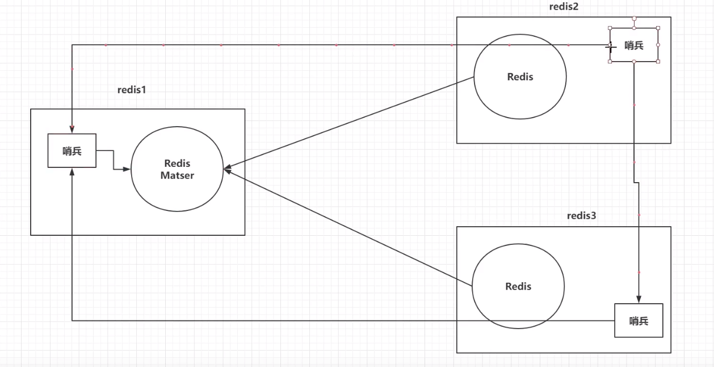

> 哨兵可以帮助我们解决主从架构中的单点故障问题

#### 演示哨兵模式

> 准备哨兵的配置文件，并且在容器内部手动启动哨兵模式即可


哨兵的配置文件`sentinel.conf`

```
#哨兵需要后台启动
daemonize no
# master节点的ip和端口，主节点的配置
sentinel monitor master localhost 6379 2
# master节点的ip和端口，从节点的配置
sentinel monitor master redis1 6379 2
#哨兵每隔10秒监听一次
sentinel down-after-milliseconds master 10000
```

1.修改docker-compose.yaml

```yaml
version: "3"
services:
   redis1:
     image: "redis"
     container_name: redis1
     restart: always
     ports:
       - "7001:6379"
     environment:
       - TZ=Asia/Shanghai
     volumes:
       - "./redis1.conf:/usr/local/redis/redis.conf"
       - "./sentinel1.conf:/usr/local/redis/sentinel.conf"
       - "./data:/data"
     command: ["redis-server","/usr/local/redis/redis.conf"]
   redis2:
     image: "redis"
     container_name: redis2
     restart: always
     ports:
       - "7002:6379"
     environment:
       - TZ=Asia/Shanghai
     volumes:
       - "./redis2.conf:/usr/local/redis/redis.conf"
       - "./sentinel2.conf:/usr/local/redis/sentinel.conf"
       - "./data:/data"
     command: ["redis-server","/usr/local/redis/redis.conf"]
   redis3:
     image: "redis"
     container_name: redis3
     restart: always
     ports:
       - "7003:6379"
     environment:
       - TZ=Asia/Shanghai
     volumes:
       - "./redis3.conf:/usr/local/redis/redis.conf"
       - "./sentinel3.conf:/usr/local/redis/sentinel.conf"
       - "./data:/data"
     command: ["redis-server","/usr/local/redis/redis.conf"]
```

1.创建三个sentinel1,2,3.conf配置文件

sentinel1.conf

```conf
#哨兵需要后台启动
daemonize yes
# master节点的ip和端口，主节点的配置
sentinel monitor master localhost 6379 2
#哨兵每隔10秒监听一次
sentinel down-after-milliseconds master 10000
```

sentinel2.conf

```
#哨兵需要后台启动
daemonize yes
#哨兵每隔10秒监听一次
# master节点的ip和端口，从节点的配置
sentinel monitor master redis1 6379 2
sentinel down-after-milliseconds master 10000
```

sentinel3.conf

```
#哨兵需要后台启动
daemonize yes
#哨兵每隔10秒监听一次
# master节点的ip和端口，从节点的配置
sentinel monitor master redis1 6379 2
sentinel down-after-milliseconds master 10000
```

2.修改docker-compose.yaml。挂载sentinel.conf

```
- ./conf/sentinel1(2,3).conf:/data/sentinel.conf
```

3.启动docker-compose

4.进入到master的容器中的/usr/local/bin目录

可以看到目录下有命令`redis-sentinel`

5.启动哨兵，指定配置文件

```sh
redis-sentinel sentinel.conf
```

6.重复4-5步骤，启动从节点的哨兵

#### 测试哨兵模式

故意停掉master节点，查看有没有选中新的master

可以发现master换了

### 5.6 redis的集群架构

> 之前的主从加哨兵模式最大的问题是：
>
> 三个节点存储了相同的数据，导致数据是全量冗余的，如果项目的数据量极大，就会导致三个节点的存数据压力都很大

redis集群在保证主从加哨兵的基本功能之外，还能提升redis存储数据的能力

#### redis集群特点

1.集群去中心化

2.redis集群有ping-pang机制，节点之间互相进行心跳检测

3.投票机制：假定redis1向redis2发请求超时，redis1就会向redis3进行询问，是否redis3也连接不上redis2，那么三个节点有两票投redis2挂掉了。

4.基于投票机制，redis集群的数量必须是2n+1

5.redis集群默认分配了16384个hash槽，在存储数据时，就会将key进行crc16算法，并且对16384去余，根据最终的结果，将key-value存放到指定的redis节点中，而且每一个redis都在维护着相应的hash槽

6、为了保证数据安全性，每一个集群的节点，至少跟着一个从节点

7.可以单独针对某一个集群中的节点搭建主从架构

8.当redis集群中，超过半数的节点宕机只有，redis集群就瘫痪了

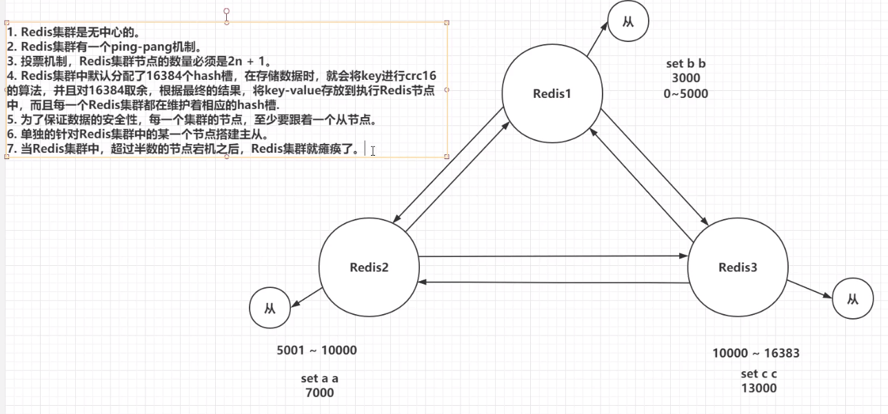

--------

#### 搭建redis集群

1.docker-compose.yaml

```yaml
version: "3.1"
services:
	redis1:
		image: redis
		restart: always
		container_name: redis1
		environment:
			- TZ=Asia/Shanghai
		ports:
			- 7001:7001
			- 17001:17001
		volumes:
			- ./conf/redis1.conf:/usr/local/redis/redis.conf
		command: ["redis-server","/usr/local/redis/redis.conf"]
	 redis2:
	 	image: redis
		restart: always
		container_name: redis2
		environment:
			- TZ=Asia/Shanghai
		ports:
			- 7002:7002
			- 17002:17002
		volumes:
			- ./conf/redis2.conf:/usr/local/redis/redis.conf
		command: ["redis-server","/usr/local/redis/redis.conf"]
	 redis3:
	 	image: redis
		restart: always
		container_name: redis3
		environment:
			- TZ=Asia/Shanghai
		ports:
			- 7003:7003
			- 17003:17003
		volumes:
			- ./conf/redis3.conf:/usr/local/redis/redis.conf
		command: ["redis-server","/usr/local/redis/redis.conf"]
	 redis4:
	 	image: redis
		restart: always
		container_name: redis4
		environment:
			- TZ=Asia/Shanghai
		ports:
			- 7004:7004
			- 17004:17004
		volumes:
			- ./conf/redis4.conf:/usr/local/redis/redis.conf
		command: ["redis-server","/usr/local/redis/redis.conf"]
	 redis5:
	 	image: redis
		restart: always
		container_name: redis5
		environment:
			- TZ=Asia/Shanghai
		ports:
			- 7005:7005
			- 17005:17005
		volumes:
			- ./conf/redis5.conf:/usr/local/redis/redis.conf
		command: ["redis-server","/usr/local/redis/redis.conf"]
	 redis6:
	 	image: redis
		restart: always
		container_name: redis6
		environment:
			- TZ=Asia/Shanghai
		ports:
			- 7006:7006
			- 17006:17006
		volumes:
			- ./conf/redis6.conf:/usr/local/redis/redis.conf
		command: ["redis-server","/usr/local/redis/redis.conf"]
	 
```

2.redis.conf

以redis1为例

```conf
#指定端口号
port 7001
#开启集群
cluster-enabled yes
#集群信息的文件
cluster-config-file nodes-7001.conf
#集群对外的ip
cluster-announce-ip 192.168.134.66
#集群对外的端口号
cluster-announce-port 7001
#集群对外的总线端口号
cluster-announce-bus-port 17001
```

3.创建目录docker_redis_cluster

4.创建docker_redis_cluster/conf目录

创建redis1.conf-redis6.conf,修改端口等配置

5.启动docker-compose

6.任意进入一个容器内部，输入以下命令创建集群

先将宿主机的firewalld防火墙关掉

```sh
systemctl stop firewalld
systemctl disable firewalld
```


```bash
redis-cli --cluster create 192.168.134.66:7001 192.168.134.66:7002 192.168.134.66:7003 192.168.134.66:7004 192.168.134.66:7005 192.168.134.66:7006 --cluster-replicas 1
```

7.连接集群

```bash
redis-cli -h 192.168.134.66 -p 7001 -c 
# -c的目的是可以在任意客户端操作集群中其他节点
set a a
set b b
set c c
```

> 注意：redis集群启动时，任意节点都是新的，内部没有持久化数据

### 5.7 java连接redis集群

```java

@Test
public void test(){
    HashSet<HostAndPort> set = new HashSet<>();
    set.add(new HostAndPort("192.168.134.66",7001));
    set.add(new HostAndPort("192.168.134.66",7002));
    set.add(new HostAndPort("192.168.134.66",7003));
    set.add(new HostAndPort("192.168.134.66",7004));
    set.add(new HostAndPort("192.168.134.66",7005));
    set.add(new HostAndPort("192.168.134.66",7006));
    
    JedisCluster cluster = new JedisCluster(set);
    
    String value = cluster.get("b");
    System.out.println(value);
}
```

## 6 redis常见问题

### 6.1 key的生存时间，redis会立即删除吗？

> 不会立即删除
>
> 1. 定期删除
>
>    redis每隔一段时间就会去查看redis设置了过期的key，会在100ms的间隔中默认查看3个key
>
> 2. 惰性删除
>
>    如果当你去查询了一个已经过期的生存时间的key，redis会先查看当前key的生存时间是否已经到了，直接删除当前的key，并且返回用户一个空值。

### 6.2 redis淘汰机制

​	根据上面的key删除机制，我们知道redis中会有一些已经该删除的数据但是没有删除，当此时我们要存入新数据时，可能会导致内存不足，那么此时redis会触发淘汰机制

查看redis.conf

```conf
# volatile-lru -> Evict using approximated LRU, only keys with an expire set.
# allkeys-lru -> Evict any key using approximated LRU.
# volatile-lfu -> Evict using approximated LFU, only keys with an expire set.
# allkeys-lfu -> Evict any key using approximated LFU.
# volatile-random -> Remove a random key having an expire set.
# allkeys-random -> Remove a random key, any key.
# volatile-ttl -> Remove the key with the nearest expire time (minor TTL)
# noeviction -> Don't evict anything, just return an error on write operations.
```

1. volatile-lru:

   在内存不足时，redis会在设置了生存时间的key中干掉一个最近最少使用的key

2. allkeys-lru：

   在内存不足时，redis会在全部的key中干掉一个最近最少使用的key

3. volatile-lfu：

   在内存不足时，redis会在设置了生存时间的key中干掉一个最近最少频次使用的key

4. allkeys-lfu：

   在内存不足时，redis会在全部的key中干掉一个最近最少频次使用的key

5. volatile-random：

   在内存不足时，redis会在设置了生存时间的key中随机干掉一个key

6. allkeys-random：

   在内存不足时，redis会在全部的key中随机干掉一个key

7. volatile-ttl：

   在内存不足时，redis会在设置了生存时间的key中干掉一个剩余生存时间最少的key

8. noeviction：（默认）

   在内存不足时，直接报错

查看配置文件

```conf
maxmemory-policy noeviction  #配置淘汰策略
maxmemory <bytes>  #指定redis最大内存数
```

### 6.3 缓存的常见问题

#### 缓存穿透

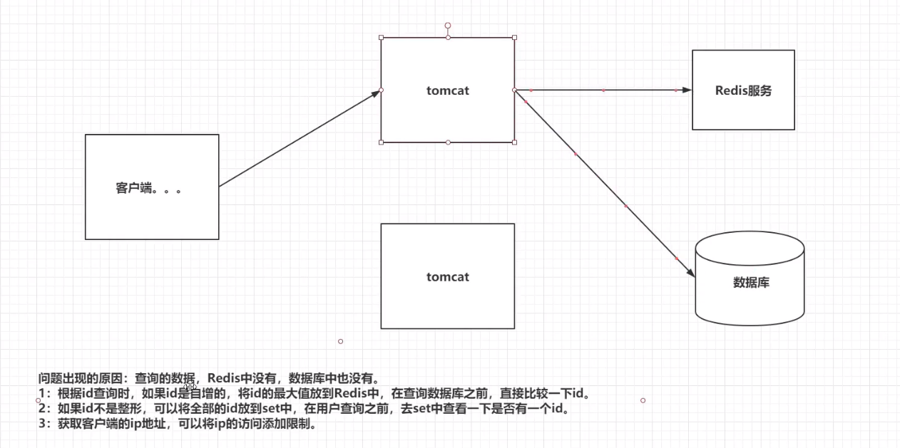

#### 缓存击穿

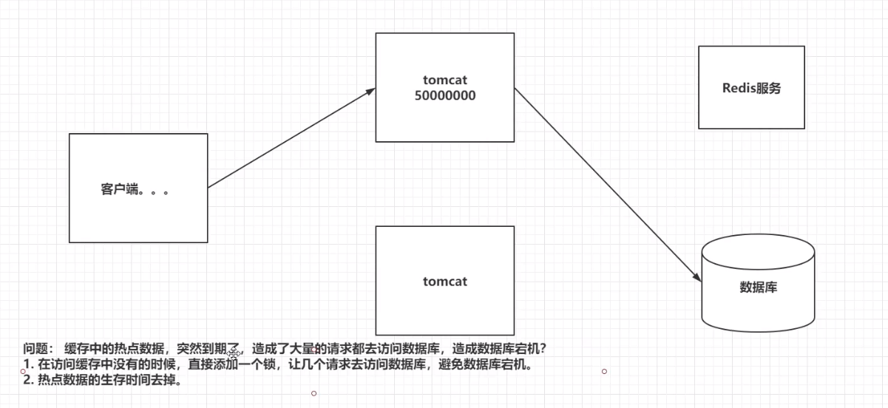

#### 缓存雪崩

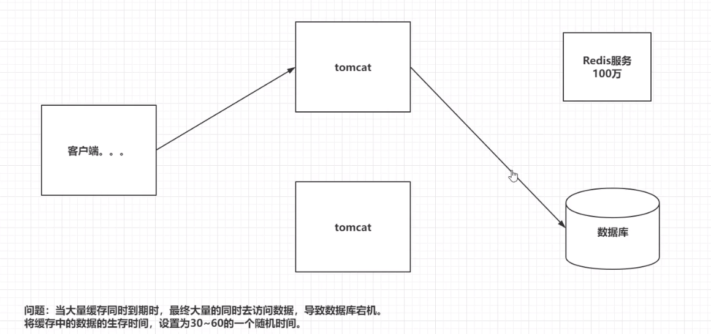

#### 缓存倾斜（redis崩溃）

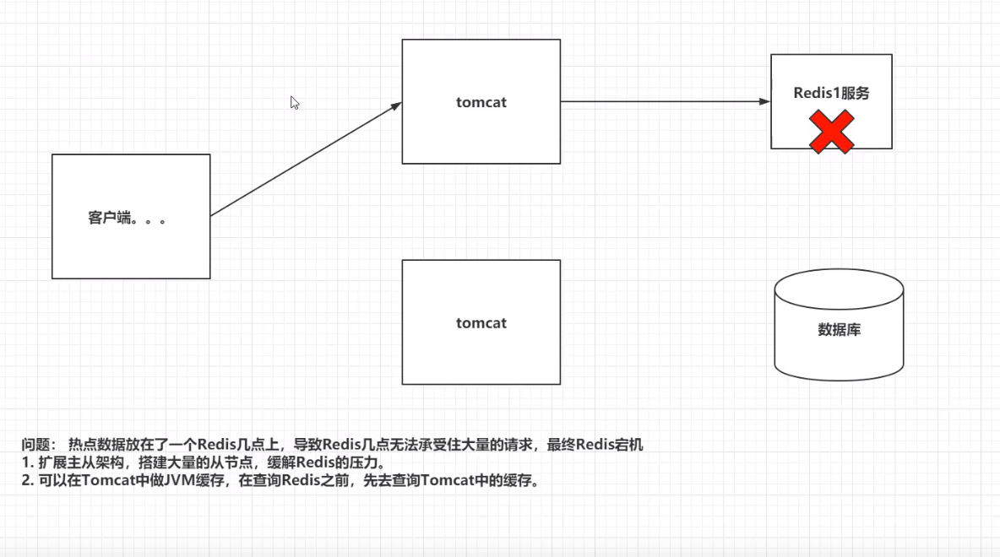

