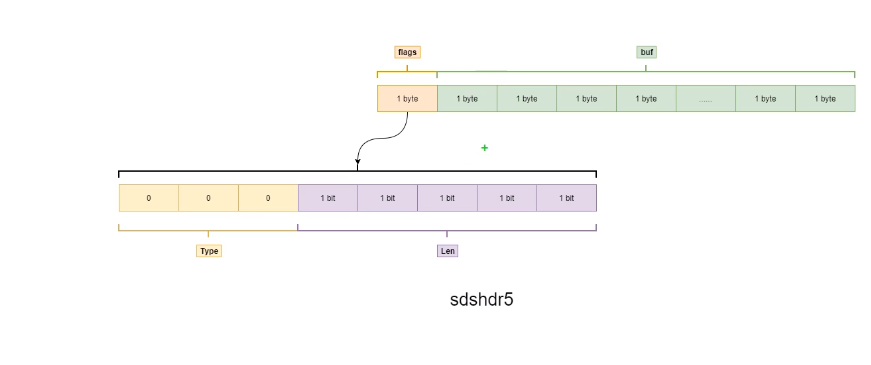

#### redis的作用

##### 1.缓存

##### 2.计数器

可以对String进行自增减运算，从而实现计数器功能，Redis读写性能高，适合存储频繁读写的计数量

##### 3.分布式id生成

利用自增特性，一次请求一个大一点的步长如incr2000，缓存在本地使用，用完再请求

##### 4.海量数据统计

位图：存储是否参加过某次活动，是否已读谋篇文章，用户是否为会员，日活统计。

##### 5.会话缓存

可以使用redis来统一存储多台应用服务器会话信息，分布式会话，由于redis具有超时时间概念，天然适合做会话

##### 6.分布式队列\阻塞队列

list是一个双向链表，可以通过lpush/rpush和rpop/lpop写入和读取消息，可以通过brpop/blpop来实现阻塞队列

#### sds字符串类型内部结构

#### key的数据结构

redis的key是通过hash算法%数组大小来得到key的数组下标的，因此存在hash冲突可能，通过链表法解决hash冲突，头插法。

#### 利用bitmap统计亿级日活用户数量

bitmap实际就是redis利用string类型的二进制形式来存储数据的

思路：

将offset作为用户id，对应的值为1，代表此用户登录，0代表没有

这样只要通过bitcount somekey 0   -1来统计bitmap中所有为1的值的个数就可以快速知道日活

> bitmap底层是string，最大为512mb，换算成bit为 512 * 1024 * 1024 *8 =4,294,967,296,可以存储42亿用户